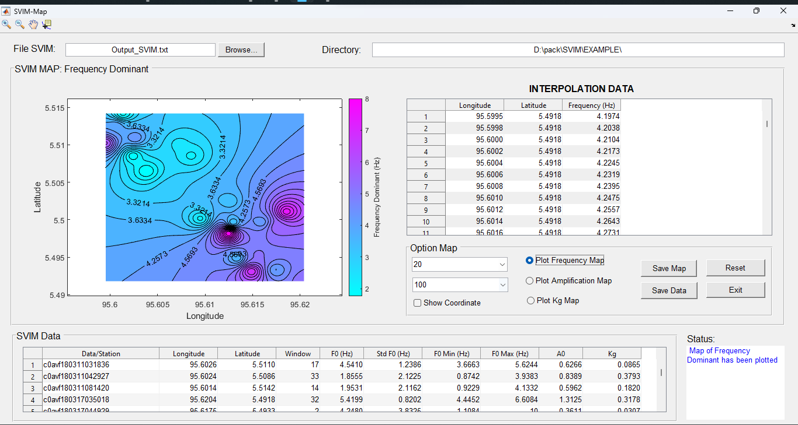

# SVIM (Seismic Vulnerability Index of Microtremor)

## Overview
The Seismic Vulnerability Index of Microtremor (SVIM) is a program to conduct microtremor data processing in MATLAB based. The principal computation in SVIM is to identify the fundamental frequency ($f_0$) and amplification factor ($A_0$) of a site by using (Nakamura, 1989) called Horizontal to Vertical Spectral Ratio (HVSR). The $f_0$ is identified from the maximum value of $A_0$ or equivalent to clear peak of smoothed HVSR curve as shown in Figure 1. The HVSR curve is smoothed using Konno-Ohmachi method. (Konno & Ohmachi, 1998). By using the $f_0$ and $A_0$, the seismic vulnerability index ($K_g$) is calculated directly in SVIM for each microtremor data. The SVIM program also has the mapping feature. This feature can be used to identify the data distribution of $f_0$, $A_0$ and $K_g$ as preliminary view.

## Installation
For the installation please refer to the [User Manual](https://github.com/auliakhalqillah/SVIM/blob/main/Manual%20SVIM%20v.1.1.pdf)

## Information
The SVIM has been tested in MATLAB R2015b and MATLAB R2019b

## Contact
email: auliakhalqillah@usk.ac.id
